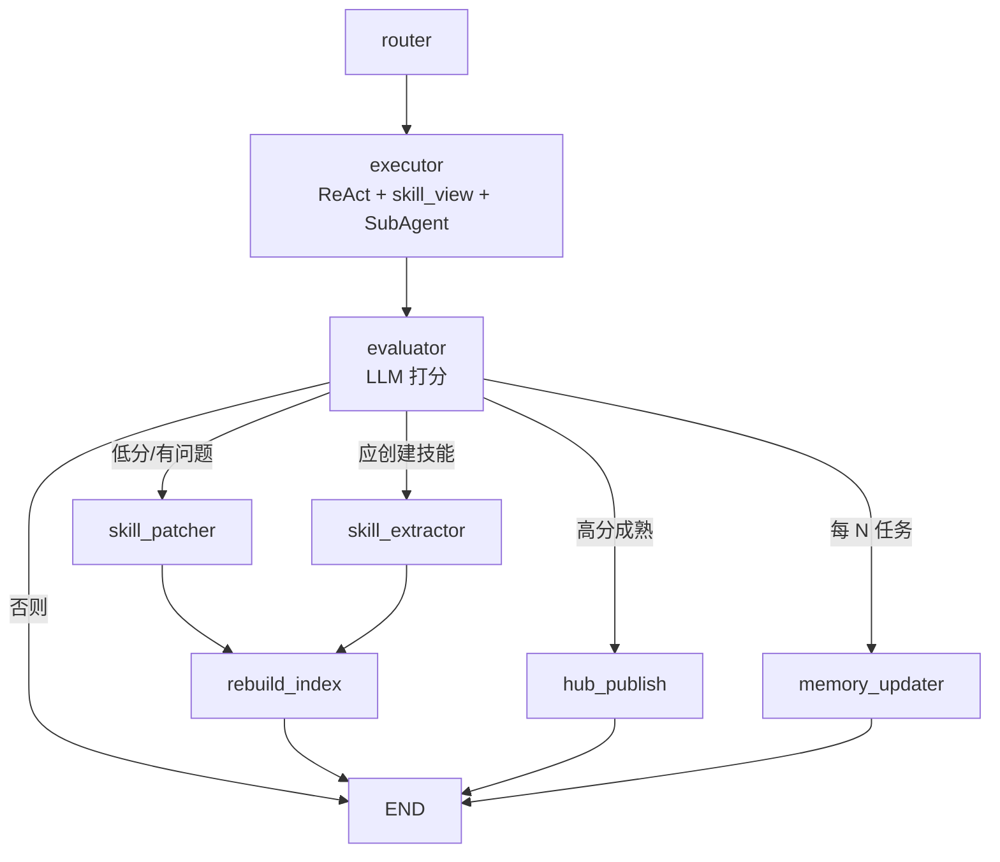
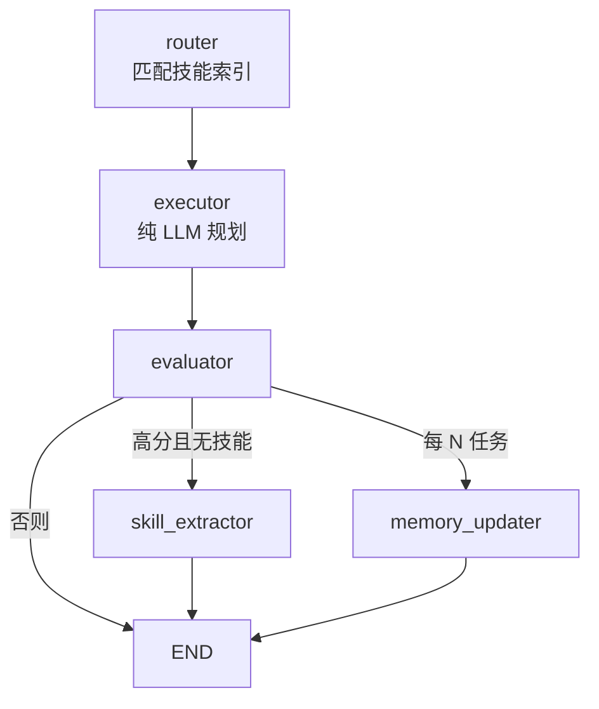

# Chapter-10 Hermes 自我进化 Agent（LangGraph）

使用 **LangGraph StateGraph** 实现 Agent **跨任务学习**：从成功执行中抽取技能（SKILL.md），下次通过 `skill_view` 渐进加载复用，并支持评估、patch、Hub 发布与 L1 热记忆整合。

旅游场景 Demo：**丽江 3 日游 → 学习技能 → 大理 3 日游 skill_view 复用**；内层业务通过 SubAgent 包装调用 `sub_agents.py`（与 Chapter-6 子智能体同源）。

## 图结构

### 完整版（`Hermes_evolution_langgraph.py`）



### 书稿简化版（`book/langgraph_evolu.py`）



## 目录说明

| 文件 / 目录 | 作用 |
|-------------|------|
| `Hermes_evolution_langgraph.py` | **主入口**：Hermes 完整闭环 + SubAgent 接法 A |
| `book/langgraph_evolu.py` | 书稿示例：自我进化闭环（`DomainConfig` 可插拔领域，默认旅游） |
| `book/langgraph_evolution.py` | 书稿早期版本（旅游场景 + Sqlite checkpoint） |
| `sub_agents.py` | Weather / Attraction / Hotel / Itinerary 等子智能体 |
| `travel_common.py` | 地图、天气、酒店等 API 与回退逻辑 |
| `weather_mcp.py` | WeatherAPI.com MCP 客户端（`npx weatherapi-mcp`） |
| `skills_tool.py` | SKILL.md 读写，Tier 0–3 渐进加载 |
| `skills_tool_view.py` | `skill_view(name, tier)` 工具 |
| `skills_index_cache.py` | 技能索引 L1/L2/L3 缓存 |
| `prompt_builder.py` | System Prompt + `<available_skills>` 索引 |
| `skill_manager_tool.py` | create / patch / rollback |
| `skills_hub.py` | 本地 Hub 发布（模拟 agentskills.io） |
| `skill_commands.py` | Skills (mandatory) 文案与 tool result 格式 |
| `security_scan.py` | 技能安全扫描 |
| `my_agent_memory/` | 运行时数据（技能库、热记忆、checkpoint，可删后重跑） |

## 安装

```bash
cd Chapter-10
pip install -r requirements.txt
```

书根目录配置 `.env`（见仓库 `.env.example`）：

| 变量 | 用途 |
|------|------|
| `DASHSCOPE_API_KEY` 或 `OPENAI_API_KEY` | 大模型（必填） |
| `AMAP_KEY` | 高德 POI / 天气（SubAgent 回退，可选） |
| `WEATHERAPI_KEY` | 天气 MCP（可选；需 Node.js + npx） |
| `WEATHER_USE_MCP=0` | 跳过 MCP，仅用高德 / wttr.in |

SubAgent 依赖 Chapter-6 的 `chapter6.paths`，运行时会自动把 `Chapter-6` 加入 `sys.path`。

## 运行

**完整 Hermes Demo（SubAgent + skill 创建/复用，较慢，需 API）：**

```bash
cd Chapter-10

# 可选：清空旧技能，重新演示「学习 → 复用」
# Windows PowerShell:
#   $env:TRAVEL_DEMO_FRESH="1"

python Hermes_evolution_langgraph.py
```

**书稿简化版（纯 LLM 规划，无 SubAgent，适合课堂快速跑通）：**

```bash
cd Chapter-10/book
python langgraph_evolu.py
```

## 代码中使用

**Hermes 完整版：**

```python
from Hermes_evolution_langgraph import create_self_improving_agent, _empty_state

agent = create_self_improving_agent(storage_dir="./my_agent_memory")
config = {"configurable": {"thread_id": "demo-1"}}

result = agent.invoke(_empty_state("请规划丽江 3 日游…"), config)
print(result["result"])
print(result["evaluation_score"], result.get("matched_skill_name"))
```

**书稿简化版：**

```python
from langgraph_evolu import SelfImprovingPattern, TRAVEL_DOMAIN

pattern = SelfImprovingPattern(storage_dir="./my_agent_memory", domain=TRAVEL_DOMAIN)
result = pattern.run("请规划大理 3 日游…", task_count=0)
print(result["result"])
```

## 两版对比

| 特性 | `book/langgraph_evolu.py` | `Hermes_evolution_langgraph.py` |
|------|---------------------------|----------------------------------|
| 执行方式 | router 预匹配 + 单次/双次 LLM | executor **ReAct** + 多工具调用 |
| 领域扩展 | `DomainConfig` 配置 prompt | 旅游 SubAgent + `skill_view` |
| 技能格式 | `skills/*.json` | `skills/*.md`（agentskills.io / SKILL.md） |
| 技能加载 | router 注入 procedure | LLM 调用 `skill_view(tier=2)` |
| 自动改进 | 无 | **patch / rollback / rebuild_index** |
| 社区发布 | 无 | **hub_publish** |
| Checkpoint | 可选 SqliteSaver | 默认 MemorySaver；`HERMES_CHECKPOINT=sqlite` 可持久化 |
| 外部 API | 无 | 天气 / 地图 / 酒店（SubAgent） |

## 演示预期（Hermes 完整版）

1. **任务1（丽江）**：SubAgent 多次调用 → 评估通过 → 创建 `domestic_3day_trip_planning`（国内三日游行程规划）
2. **任务2（大理）**：`skill_view('domestic_3day_trip_planning')` → 复用 SubAgent → 更新 `uses` / `avg_score`

注意：`skill_view` 的 `name` 必须与 `<available_skills>` 索引中的**技能名**一致，不能误用 `travel_planning`（那是 task_type 标签）。

## 依赖

见 `requirements.txt`：`langchain`、`langgraph`、`langgraph-checkpoint-sqlite`（书稿 Sqlite checkpoint）、`pyyaml` 等。

与 Chapter-6 子智能体共用：`httpx`、`python-dotenv`；天气 MCP 另需本机 **Node.js**（`npx weatherapi-mcp`）。
