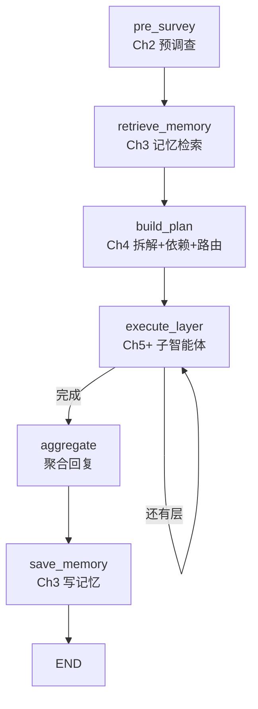

# Chapter-6 固定图（fixed_graph）实现

使用 **LangGraph StateGraph** 重构中心智能体，功能与 `central_orchestrator.py` 等价。

包名 `fixed_graph` 刻意避开 pip 包 `langgraph`，可直接 `from langgraph.graph import StateGraph` 正常导入。

## 图结构



## 安装（推荐）

在 `Chapter-6` 目录下可编辑安装，之后全项目用正常 import：

```bash
cd Chapter-6
pip install -e .
```

## 运行

**只看图结构（无需 API Key）：**

```bash
cd Chapter-6
python -m fixed_graph.show_graph
```

**完整演示（需要 API Key）：**

```bash
python -m fixed_graph.run_demo
```

## Notebook 中使用

```python
from fixed_graph.orchestrator import LangGraphOrchestrator

orchestrator = LangGraphOrchestrator(enable_memory=True)
orchestrator.show_graph()

result = await orchestrator.process_request("查询上海明天天气", thread_id="lg_001")
print(result["final_response"])
```

## 与 `CentralOrchestrator` 对比

| 特性 | `central_orchestrator.py` | `fixed_graph/` |
|------|---------------------------|----------------|
| 工作流表达 | Python 顺序代码 | StateGraph 节点 + 边 |
| Checkpoint | 无 | `MemorySaver` 支持 thread 恢复 |
| 子任务执行 | `_execute_subtasks` 循环 | `execute_layer` 条件边循环 |
| 可视化 | 无 | `show_graph()` / `save_graph()` |
| 业务逻辑 | 相同 | 复用同一套 prompts / planner / sub_agents |

## 依赖

与 Chapter-6 相同：`langgraph>=0.0.30`，见 `requirements.txt`。
