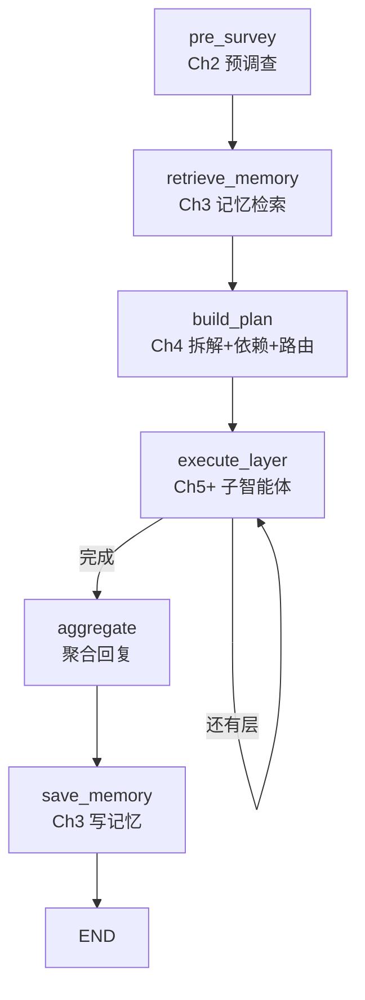

# Chapter-6 LangGraph 实现

使用 **LangGraph StateGraph** 重构中心智能体，功能与 `central_orchestrator.py` 等价。

> **注意**：目录名 `langgraph` 与 pip 包 `langgraph` 同名。导入时请把 `Chapter-6/langgraph` 加入 `sys.path`，然后 `from orchestrator import LangGraphOrchestrator`，避免与 pip 包冲突。

## 图结构



## 文件说明

| 文件 | 职责 |
|------|------|
| `state.py` | `CentralAgentState` 图状态定义 |
| `nodes.py` | 各节点实现（复用 TaskPlanner / Memory / SubAgent） |
| `graph.py` | `StateGraph` 构建与编译 |
| `orchestrator.py` | `LangGraphOrchestrator` 对外入口 |
| `run_demo.py` | 命令行演示 |
| `visualize.py` | 图结构导出（Mermaid / ASCII / PNG） |
| `show_graph.py` | 仅查看图结构，不调用 LLM |

## 运行

**只看图结构（无需 API Key）：**

```bash
cd Chapter-6/langgraph_demo
python show_graph.py
```

输出保存在 `output/`（全部由 LangGraph `app.get_graph()` 自动生成）：
- `central_agent_graph.png` — `draw_mermaid_png()`
- `central_agent_graph.mmd` — `draw_mermaid()`
- `central_agent_graph.txt` — 从 `nodes` / `edges` 导出的摘要 + `draw_ascii()`

ASCII 图需要 `grandalf`（已写入 `requirements.txt`）。

**完整演示（需要 API Key）：**

```bash
python run_demo.py
```

运行前会先打印并保存图结构，再执行多城市旅行规划请求。

## Notebook 中使用

```python
import sys
from pathlib import Path

CHAPTER6 = Path.cwd()  # 若在 Chapter-6 目录
sys.path.insert(0, str(CHAPTER6))
sys.path.insert(0, str(CHAPTER6 / "langgraph_demo"))

from orchestrator import LangGraphOrchestrator

orchestrator = LangGraphOrchestrator(enable_memory=True)

# 查看 / 保存图结构
orchestrator.show_graph()
orchestrator.save_graph()

result = await orchestrator.process_request("查询上海明天天气", thread_id="lg_001")
print(result["final_response"])
```

## 与 `CentralOrchestrator` 对比

| 特性 | `central_orchestrator.py` | `langgraph/` |
|------|---------------------------|--------------|
| 工作流表达 | Python 顺序代码 | StateGraph 节点 + 边 |
| Checkpoint | 无 | `MemorySaver` 支持 thread 恢复 |
| 子任务执行 | `_execute_subtasks` 循环 | `execute_layer` 条件边循环 |
| 可视化 | 无 | `show_graph()` / `save_graph()` / `show_graph.py` |
| 业务逻辑 | 相同 | 复用同一套 prompts / planner / sub_agents |

## 依赖

与 Chapter-6 相同：`langgraph>=0.0.30`，见上级 `requirements.txt`。
